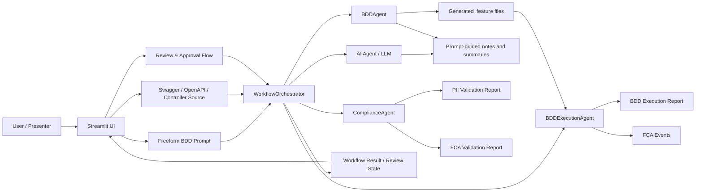

# Compliance BDDs AI Studio Architecture

## Presentation note
Use this diagram to explain how the app turns a user prompt and API input into generated BDDs, reviewable artifacts, and compliance reports.
